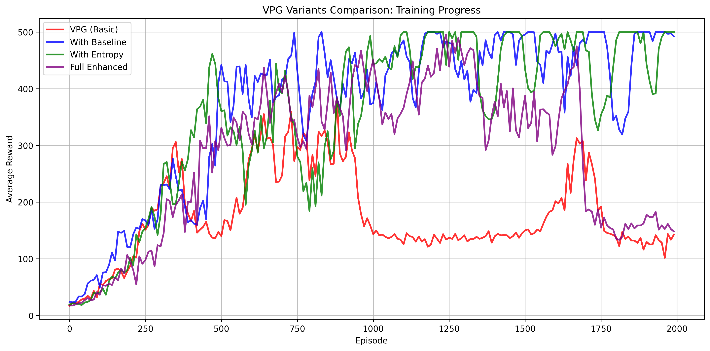

# JAX Policy Gradient Implementation

A JAX implementation of policy gradient methods with stability enhancements for CartPole-v1. Features baseline subtraction, entropy regularization, gradient clipping, and per-episode normalization for robust training.

## Summary

This implementation demonstrates how various enhancements to vanilla policy gradient methods improve training stability and performance. The key improvements include:

- **Baseline subtraction** for variance reduction
- **Entropy regularization** for exploration
- **Gradient clipping** for stability
- **Per-episode normalization** for fair comparison

<!-- ### Training Results

 -->

### Run

#### Default (Full Enhanced VPG)
```bash
python3 main.py
```

#### VPG (no enhancements)
```bash
python3 main.py --no-baseline --no-entropy --no-gradient-clipping --no-per-episode-norm
```

#### Custom Configurations
```bash
# Just baseline subtraction
python3 main.py --no-entropy --no-gradient-clipping --no-per-episode-norm

# Custom training parameters
python3 main.py --episodes 2000 --lr 0.0005 --entropy-coef 0.02

# Headless training (no rendering)
python3 main.py --no-render --no-plot

# Quick test run
python3 main.py --episodes 200 --episodes-per-update 10 --eval-episodes 1
```

#### Comparison Mode
```bash
# Run comparison of all variants defined in variants.py
python3 main.py --compare

# Run comparison with custom parameters
python3 main.py --compare --episodes 1000 --episodes-per-update 20

# List available variants
python3 main.py --list-variants
```

#### All CLI Options
```bash
python3 main.py --help
```

### Installation (CUDA Support)
```
pip install -r requirements.txt -f https://storage.googleapis.com/jax-releases/jax_cuda_releases.html
```


## VPG Implementation Enhancements

This implementation extends vanilla VPG (Vanilla Policy Gradient) with several key improvements for better training stability and performance:

### 1. **Baseline Subtraction**
Instead of using raw returns R_t in the policy gradient, we compute advantages A_t = R_t - b where b = E[R_t] is the baseline. This reduces variance in the gradient estimates:

```
∇_θ J(θ) = E[∇_θ log π_θ(a|s) · A_t]
```

Implemented as `baseline = jnp.mean(jnp.array(returns))` and `advantage = ret - baseline`.

### 2. **Gradient Clipping**
Added gradient clipping to prevent gradient explosion. The gradient norm is clipped to a maximum value of 1.0:

```
grad = grad · min(1.0, 1.0/||grad||_2)
```

Implemented using `optax.clip_by_global_norm(1.0)` in the optimizer chain.

### 3. **Per-Episode Return Normalization**
Returns are normalized per episode to have zero mean and unit variance:

```
R'_t = (R_t - μ_e) / (σ_e + ε)
```

where μ_e and σ_e are the mean and standard deviation of returns in episode e. This prevents bias from episode length differences.

### 4. **Entropy Regularization**
Added entropy regularization to encourage exploration. The loss function becomes:

```
L(θ) = -log π_θ(a|s) · A_t - β · H(π_θ)
```

where H(π_θ) = -Σ_a π_θ(a|s) log π_θ(a|s) is the policy entropy and β = 0.01 is the entropy coefficient.

### Customizing Variants

To add your own variants for comparison, edit `variants.py`:

```python
# Add custom variants
CUSTOM_VARIANTS = {
    "High Entropy": {
        "use_baseline": True,
        "use_entropy": True,
        "use_gradient_clipping": True,
        "use_per_episode_norm": True,
        "entropy_coef": 0.05,  # Higher entropy
        "description": "VPG with high entropy regularization"
    }
}

def get_variants():
    return CUSTOM_VARIANTS  # Override to use your variants
```